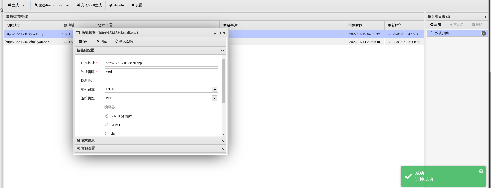

# Laravel漏洞复现

------

## Laravel 远程代码执行漏洞(CVE-2021-3129)

### 漏洞简述

```php
 Laravel是一套简洁、开源的PHP Web开发框架，旨在实现Web软件的MVC架构。 Laravel开启了Debug模式时，由于Laravel自带的Ignition 组件对file_get_contents()和file_put_contents()函数的不安全使用，攻击者可以通过发起恶意请求，构造恶意Log文件等方式触发Phar反序列化，最终造成远程代码执行。
```


------

### 影响版本

- Laravel 框架 < 8.4.3
- facade ignition 组件 < 2.5.2


------

###  环境搭建

目前 Vulfocus 已经集成 Laravel 环境，可通过以下命令进行拉取运行：

```php
docker pull vulfocus/laravel-cve_2021_3129:latest
docker run -d -P vulfocus/laravel-cve_2021_3129
```

也可使用线上环境 http://vulfocus.fofa.so/ 进行测试


------

### 复现过程

1、下载exp攻击写入Webshell

下载地址：https://github.com/SecPros-Team/laravel-CVE-2021-3129-EXP

```php
python exp.py
```


2、用中国蚁剑连接Webshell




------

### 漏洞修复

1. 临时修复方案：若业务环境允许，使用白名单限制相关web项目的访问来降低风险。
2. 通用修复建议：建议将 Laravel 框架升级至8.4.3及其以上版本，或者将 facade ignition组件升级至 2.5.2 及其以上版本。

